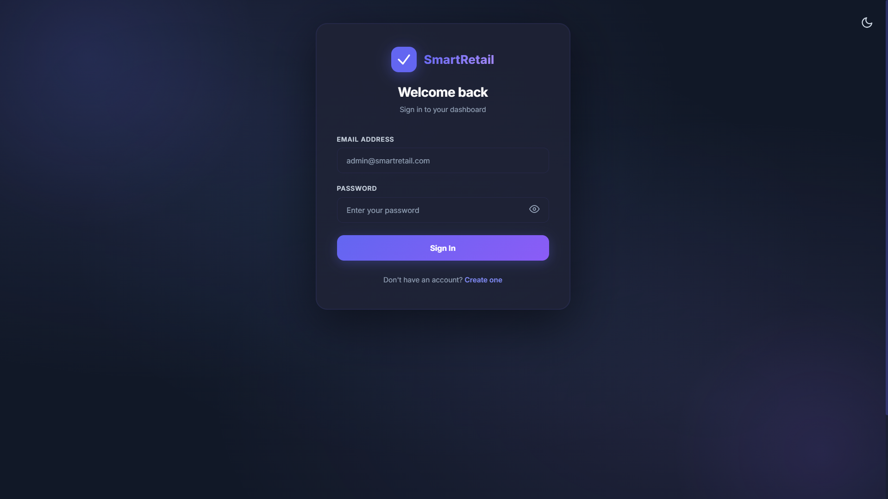
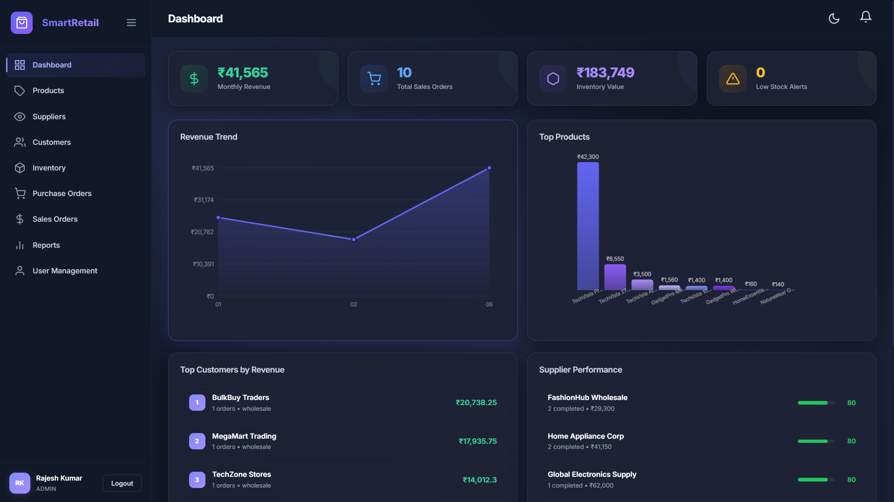
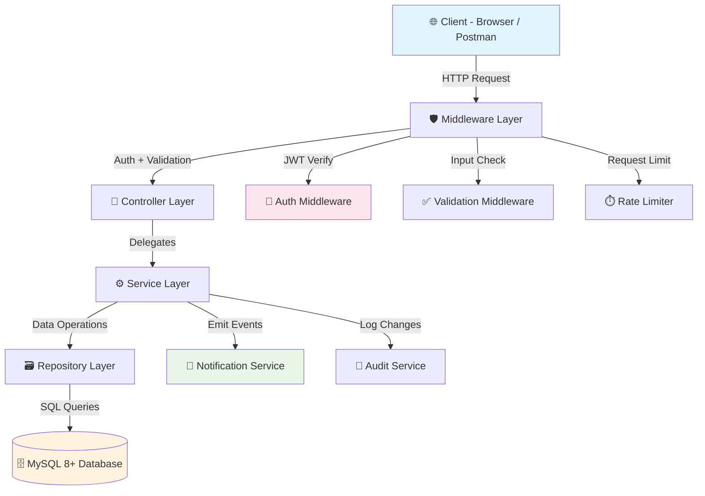

<h1 align="center">🏪 Smart Retail Inventory Management System</h1>

<p align="center">
  An inventory management system built with Node.js, Express.js, and MySQL. Supports role-based access control, real-time stock tracking, purchase/sales order workflows, and analytics dashboards.
</p>

<p align="center">
  
  
  
  
  
</p>

---

## 📋 Table of Contents

- [Screenshots](#-screenshots)
- [Feature Highlights](#-feature-highlights)
- [System Architecture](#-system-architecture)
- [Tech Stack](#-tech-stack)
- [Prerequisites](#-prerequisites)
- [Installation & Setup](#-installation--setup)
- [Database Setup](#-database-setup)
- [API Endpoints Summary](#-api-endpoints-summary)
- [Project Structure](#-project-structure)
- [License](#-license)
- [Author](#-author)

---

## 📸 Screenshots
<div align="center">

### 🏠 Landing Page - Feature of Dark Theme and Light Theme


<br/><br/>

### 🗄️ Dashboard


</div>

| Screen              | Description                                                               |
| ------------------- | ------------------------------------------------------------------------- |
| **Dashboard**       | Main analytics dashboard with KPI cards, revenue charts, and stock alerts |
| **Product List**    | Paginated product grid with search, filter, and sort capabilities         |
| **Purchase Order**  | PO creation form with supplier selection and line item management         |
| **Sales Order**     | SO creation with customer selection, product picker, and auto-pricing     |
| **Inventory View**  | Multi-warehouse stock levels with visual indicators for low stock         |
| **Reports**         | Inventory valuation and ABC analysis reports with exportable tables       |
| **User Management** | Admin panel for managing users, roles, and permissions                    |
| **Audit Trail**     | Searchable audit log showing all system modifications                     |

---

## ✨ Feature Highlights

- 🔐 **JWT Authentication & RBAC** — JWT auth with role-based access control (Admin, Manager, Staff, Viewer)
- 📦 **Product Management** — Full CRUD for products with category/brand/supplier associations and image support
- 🏭 **Multi-Warehouse Inventory** — Track stock across multiple warehouse locations with real-time quantity updates
- 📋 **Purchase Order Workflow** — Complete PO lifecycle: Draft → Approved → Ordered → Received → Closed
- 🛒 **Sales Order Workflow** — End-to-end sales: Draft → Confirmed → Shipped → Delivered with payment tracking
- 💰 **Payment Processing** — Record and track payments against sales orders with multiple payment methods
- 📊 **Analytics Dashboard** — Revenue trends, top-selling products, stock valuation, and inventory turnover reports
- 🔔 **Smart Notifications** — Automatic alerts for low stock, expiring products, and pending approvals
- 📝 **Audit Trail** — Logs all data modifications with before/after snapshots
- 🔍 **Search & Filtering** — Pagination, sorting, and filtering on all tables
- 📈 **Reports** — Inventory valuation, sales/purchase summaries, and ABC analysis
- 🛡️ **Input Validation** — Request validation with express-validator
- ⚡ **Optimized Queries** — B-Tree, composite, and covering indexes for fast lookups
- 🗄️ **20-Table Schema** — Third Normal Form (3NF) database design

---

## 🏗️ System Architecture

The app uses a **layered architecture**:

```
Client (Browser / Postman)
        │
        ▼
┌─────────────────────────────┐
│     Express.js Server       │
│  ┌───────────────────────┐  │
│  │   Middleware Layer    │  │
│  │  (Auth, Validation,   │  │
│  │   Rate Limit, CORS)   │  │
│  └──────────┬────────────┘  │
│  ┌──────────▼────────────┐  │
│  │   Controller Layer    │  │
│  │  (Route Handlers)     │  │
│  └──────────┬────────────┘  │
│  ┌──────────▼────────────┐  │
│  │    Service Layer      │  │
│  │  (Business Logic)     │  │
│  └──────────┬────────────┘  │
│  ┌──────────▼────────────┐  │
│  │   Repository Layer    │  │
│  │  (Data Access / SQL)  │  │
│  └──────────┬────────────┘  │
└─────────────┼───────────────┘
              │
        ┌─────▼─────┐
        │  MySQL 8+ │
        │  Database │
        └───────────┘
```



---

## 🛠️ Tech Stack

| Layer                | Technology         | Purpose                                           |
| -------------------- | ------------------ | ------------------------------------------------- |
| **Runtime**          | Node.js 18+        | Server-side JavaScript runtime                    |
| **Framework**        | Express.js 4.x     | REST API framework with middleware support        |
| **Database**         | MySQL 8+           | Relational database with ACID compliance          |
| **Authentication**   | JWT (jsonwebtoken) | Stateless token-based authentication              |
| **Password Hashing** | bcrypt             | Industry-standard password hashing with salting   |
| **Validation**       | express-validator  | Request body/query/param validation               |
| **Frontend**         | Vanilla JavaScript | Lightweight client-side rendering                 |
| **Styling**          | CSS3 / Bootstrap 5 | Responsive UI components                          |
| **DB Driver**        | mysql2             | MySQL driver with connection pooling and Promises |
| **Environment**      | dotenv             | Environment variable management                   |
| **Logging**          | winston            | Structured logging with multiple transports       |
| **Testing**          | Jest + Supertest   | Unit and integration testing                      |

---

## 📋 Prerequisites

Before you begin, ensure you have the following installed:

| Requirement | Version        | Check Command     |
| ----------- | -------------- | ----------------- |
| **Node.js** | 18.0 or higher | `node --version`  |
| **npm**     | 9.0 or higher  | `npm --version`   |
| **MySQL**   | 8.0 or higher  | `mysql --version` |
| **Git**     | 2.30 or higher | `git --version`   |

---

## 🚀 Installation & Setup

### 1. Clone the Repository

```bash
git clone https://github.com/yourusername/smart-retail-inventory.git
cd smart-retail-inventory
```

### 2. Install Dependencies

```bash
npm install
```

### 3. Set Up MySQL Database

```bash
# Log into MySQL
mysql -u root -p

# Create the database
CREATE DATABASE smart_retail_inventory;
EXIT;
```

### 4. Import Database Schema

Execute SQL scripts in the following order:

```bash
# 1. Create tables
mysql -u root -p smart_retail_inventory < database/schema.sql

# 2. Create indexes
mysql -u root -p smart_retail_inventory < database/indexes.sql

# 3. Create stored procedures
mysql -u root -p smart_retail_inventory < database/procedures.sql

# 4. Create triggers
mysql -u root -p smart_retail_inventory < database/triggers.sql

# 5. Create analytical views
mysql -u root -p smart_retail_inventory < database/views.sql

# 6. Seed initial data (roles, permissions, admin user, demo data)
mysql -u root -p smart_retail_inventory < database/seed.sql
```

### 5. Configure Environment Variables

```bash
# Copy the example environment file
cp .env.example .env
```

Edit `.env` with your configuration:

```env
# Server Configuration
PORT=3000
NODE_ENV=development

# Database Configuration
DB_HOST=localhost
DB_PORT=3306
DB_USER=root
DB_PASSWORD=your_mysql_password
DB_NAME=smart_retail_inventory
DB_CONNECTION_LIMIT=10

# JWT Configuration
JWT_SECRET=your_super_secret_jwt_key_change_this_in_production
JWT_EXPIRES_IN=24h
JWT_REFRESH_EXPIRES_IN=7d

# Bcrypt Configuration
BCRYPT_SALT_ROUNDS=12

# Logging
LOG_LEVEL=info
```

### 6. Start the Application

```bash
# Development mode (with auto-restart)
npm run dev

# Production mode
npm start
```

The server will start at `http://localhost:3000`

---

## 🗄️ Database Setup

### SQL Script Execution Order

| Order | File             | Description                                                      |
| ----- | ---------------- | ---------------------------------------------------------------- |
| 1️⃣    | `schema.sql`     | Creates all 20 tables with constraints and foreign keys          |
| 2️⃣    | `indexes.sql`    | Adds performance indexes (B-Tree, composite, covering)           |
| 3️⃣    | `procedures.sql` | Creates 6 stored procedures for complex operations               |
| 4️⃣    | `triggers.sql`   | Sets up 5 trigger groups for auto-calculations and audit logging |
| 5️⃣    | `views.sql`      | Creates 5 analytical views for business reporting                |
| 6️⃣    | `seed.sql`       | Seeds roles, permissions, demo users, and sample data            |

> ⚠️ **Important:** Scripts must be executed in order due to foreign key dependencies. Running them out of order will result in errors.

---

## 📡 API Endpoints Summary

### Authentication

| Method | Endpoint                     | Description                 | Auth |
| ------ | ---------------------------- | --------------------------- | ---- |
| `POST` | `/api/v1/auth/register`      | Register a new user         | ❌   |
| `POST` | `/api/v1/auth/login`         | Login and receive JWT token | ❌   |
| `POST` | `/api/v1/auth/refresh-token` | Refresh an expired JWT      | ✅   |
| `POST` | `/api/v1/auth/logout`        | Invalidate current token    | ✅   |
| `GET`  | `/api/v1/auth/me`            | Get current user profile    | ✅   |

### Products

| Method   | Endpoint               | Description                   | Auth |
| -------- | ---------------------- | ----------------------------- | ---- |
| `GET`    | `/api/v1/products`     | List all products (paginated) | ✅   |
| `GET`    | `/api/v1/products/:id` | Get product by ID             | ✅   |
| `POST`   | `/api/v1/products`     | Create a new product          | ✅   |
| `PUT`    | `/api/v1/products/:id` | Update a product              | ✅   |
| `DELETE` | `/api/v1/products/:id` | Soft-delete a product         | ✅   |

### Suppliers

| Method   | Endpoint                | Description            | Auth |
| -------- | ----------------------- | ---------------------- | ---- |
| `GET`    | `/api/v1/suppliers`     | List all suppliers     | ✅   |
| `GET`    | `/api/v1/suppliers/:id` | Get supplier by ID     | ✅   |
| `POST`   | `/api/v1/suppliers`     | Create a new supplier  | ✅   |
| `PUT`    | `/api/v1/suppliers/:id` | Update a supplier      | ✅   |
| `DELETE` | `/api/v1/suppliers/:id` | Soft-delete a supplier | ✅   |

### Customers

| Method   | Endpoint                | Description            | Auth |
| -------- | ----------------------- | ---------------------- | ---- |
| `GET`    | `/api/v1/customers`     | List all customers     | ✅   |
| `GET`    | `/api/v1/customers/:id` | Get customer by ID     | ✅   |
| `POST`   | `/api/v1/customers`     | Create a new customer  | ✅   |
| `PUT`    | `/api/v1/customers/:id` | Update a customer      | ✅   |
| `DELETE` | `/api/v1/customers/:id` | Soft-delete a customer | ✅   |

### Categories & Brands

| Method | Endpoint             | Description         | Auth |
| ------ | -------------------- | ------------------- | ---- |
| `GET`  | `/api/v1/categories` | List all categories | ✅   |
| `POST` | `/api/v1/categories` | Create a category   | ✅   |
| `GET`  | `/api/v1/brands`     | List all brands     | ✅   |
| `POST` | `/api/v1/brands`     | Create a brand      | ✅   |

### Warehouses & Inventory

| Method | Endpoint                     | Description                       | Auth |
| ------ | ---------------------------- | --------------------------------- | ---- |
| `GET`  | `/api/v1/warehouses`         | List all warehouses               | ✅   |
| `POST` | `/api/v1/warehouses`         | Create a warehouse                | ✅   |
| `GET`  | `/api/v1/inventory`          | Get inventory levels              | ✅   |
| `POST` | `/api/v1/inventory/adjust`   | Manual stock adjustment           | ✅   |
| `POST` | `/api/v1/inventory/transfer` | Transfer stock between warehouses | ✅   |

### Purchase Orders

| Method  | Endpoint                              | Description                 | Auth |
| ------- | ------------------------------------- | --------------------------- | ---- |
| `GET`   | `/api/v1/purchase-orders`             | List all purchase orders    | ✅   |
| `GET`   | `/api/v1/purchase-orders/:id`         | Get PO by ID with items     | ✅   |
| `POST`  | `/api/v1/purchase-orders`             | Create a new purchase order | ✅   |
| `PUT`   | `/api/v1/purchase-orders/:id`         | Update a purchase order     | ✅   |
| `PATCH` | `/api/v1/purchase-orders/:id/approve` | Approve a purchase order    | ✅   |
| `PATCH` | `/api/v1/purchase-orders/:id/receive` | Receive goods for a PO      | ✅   |

### Sales Orders

| Method  | Endpoint                           | Description              | Auth |
| ------- | ---------------------------------- | ------------------------ | ---- |
| `GET`   | `/api/v1/sales-orders`             | List all sales orders    | ✅   |
| `GET`   | `/api/v1/sales-orders/:id`         | Get SO by ID with items  | ✅   |
| `POST`  | `/api/v1/sales-orders`             | Create a new sales order | ✅   |
| `PATCH` | `/api/v1/sales-orders/:id/confirm` | Confirm a sales order    | ✅   |
| `PATCH` | `/api/v1/sales-orders/:id/ship`    | Ship a sales order       | ✅   |
| `PATCH` | `/api/v1/sales-orders/:id/deliver` | Mark as delivered        | ✅   |

### Payments

| Method | Endpoint               | Description       | Auth |
| ------ | ---------------------- | ----------------- | ---- |
| `GET`  | `/api/v1/payments`     | List all payments | ✅   |
| `POST` | `/api/v1/payments`     | Record a payment  | ✅   |
| `GET`  | `/api/v1/payments/:id` | Get payment by ID | ✅   |

### Reports & Analytics

| Method | Endpoint                              | Description             | Auth |
| ------ | ------------------------------------- | ----------------------- | ---- |
| `GET`  | `/api/v1/reports/inventory-valuation` | Stock valuation report  | ✅   |
| `GET`  | `/api/v1/reports/sales-summary`       | Sales summary report    | ✅   |
| `GET`  | `/api/v1/reports/purchase-summary`    | Purchase summary report | ✅   |
| `GET`  | `/api/v1/reports/abc-analysis`        | ABC inventory analysis  | ✅   |
| `GET`  | `/api/v1/analytics/revenue-trends`    | Revenue trend data      | ✅   |
| `GET`  | `/api/v1/analytics/top-products`      | Top-selling products    | ✅   |
| `GET`  | `/api/v1/analytics/stock-alerts`      | Low stock alerts        | ✅   |

### Notifications & Audit

| Method  | Endpoint                         | Description               | Auth |
| ------- | -------------------------------- | ------------------------- | ---- |
| `GET`   | `/api/v1/notifications`          | Get user notifications    | ✅   |
| `PATCH` | `/api/v1/notifications/:id/read` | Mark notification as read | ✅   |
| `GET`   | `/api/v1/audit-logs`             | Get audit trail logs      | ✅   |

---

## 📁 Project Structure

```
smart-retail-inventory/
├── database/
│   ├── schema.sql                # 20-table schema DDL
│   ├── indexes.sql               # Composite & covering indexes
│   ├── procedures.sql            # 6 stored procedures
│   ├── triggers.sql              # 5 trigger groups
│   ├── views.sql                 # 5 analytical views
│   └── seed.sql                  # Demo data seed
├── docs/
│   ├── API_DOCUMENTATION.md
│   ├── ARCHITECTURE.md
│   ├── DATABASE_DESIGN.md
│   ├── GITHUB_OPTIMIZATION.md
│   ├── INDEXING_STRATEGY.md
│   ├── INTERVIEW_PREPARATION.md
│   └── RESUME_BULLETS.md
├── src/
│   ├── app.js                    # Express app setup
│   ├── config/
│   │   ├── database.js           # MySQL connection pool
│   │   └── jwt.js                # JWT configuration
│   ├── middleware/
│   │   ├── auth.middleware.js    # JWT verification
│   │   ├── rbac.middleware.js    # RBAC authorization
│   │   ├── validate.middleware.js # express-validator handler
│   │   └── errorHandler.middleware.js # Global error handler
│   ├── validators/               # 11 request validation modules
│   ├── repositories/             # 14 data access classes
│   ├── services/                 # 15 business logic classes
│   ├── controllers/              # 15 request handlers
│   ├── routes/                   # 16 route files (15 modules + index.js)
│   └── utils/
│       ├── ApiError.js           # Custom error class
│       ├── ApiResponse.js        # Standardized response formatter
│       ├── asyncHandler.js       # Async error wrapper
│       ├── helpers.js            # PO/SO/Payment number generators
│       └── logger.js             # Console logger
├── public/
│   ├── index.html                # Main SPA dashboard
│   ├── login.html                # Login page
│   ├── register.html             # Registration page
│   ├── css/
│   │   ├── main.css              # Core styles & design system
│   │   ├── dashboard.css         # Dashboard layout styles
│   │   ├── forms.css             # Form & auth styles
│   │   └── tables.css            # Data table styles
│   └── js/
│       ├── api.js                # API client with JWT management
│       ├── auth.js               # Login/register handlers
│       ├── app.js                # SPA navigation & utilities
│       ├── dashboard.js          # Dashboard KPIs & charts
│       ├── products.js           # Product CRUD module
│       ├── suppliers.js          # Supplier management
│       ├── customers.js          # Customer management
│       ├── inventory.js          # Stock levels & movements
│       ├── purchaseOrders.js     # PO management
│       ├── salesOrders.js        # SO management
│       └── reports.js            # Business reports
├── tests/
│   ├── setup.js                  # Test helpers & runner
│   └── api-test-scripts.md       # curl test commands
├── .env.example
├── .gitignore
├── package.json
├── server.js                     # Entry point
└── README.md
```

---

## 📄 License

This project is licensed under the **MIT License** — see the [LICENSE](./LICENSE) file for details.

```
MIT License

Copyright (c) 2026 Smart Retail Inventory

Permission is hereby granted, free of charge, to any person obtaining a copy
of this software and associated documentation files (the "Software"), to deal
in the Software without restriction, including without limitation the rights
to use, copy, modify, merge, publish, distribute, sublicense, and/or sell
copies of the Software, and to permit persons to whom the Software is
furnished to do so, subject to the following conditions:

The above copyright notice and this permission notice shall be included in all
copies or substantial portions of the Software.

THE SOFTWARE IS PROVIDED "AS IS", WITHOUT WARRANTY OF ANY KIND, EXPRESS OR
IMPLIED, INCLUDING BUT NOT LIMITED TO THE WARRANTIES OF MERCHANTABILITY,
FITNESS FOR A PARTICULAR PURPOSE AND NONINFRINGEMENT. IN NO EVENT SHALL THE
AUTHORS OR COPYRIGHT HOLDERS BE LIABLE FOR ANY CLAIM, DAMAGES OR OTHER
LIABILITY, WHETHER IN AN ACTION OF CONTRACT, TORT OR OTHERWISE, ARISING FROM,
OUT OF OR IN CONNECTION WITH THE SOFTWARE OR THE USE OR OTHER DEALINGS IN THE
SOFTWARE.
```

---

## 👨‍💻 Author

<div align="center">

**Krish Dhaked**

[](mailto:krishdhaked777@gmail.com)
[](https://github.com/kd5778)
[](https://linkedin.com/in/krishdhaked5778)

</div>

<p align="center">
  Made with ❤️ for learning and building
</p>
